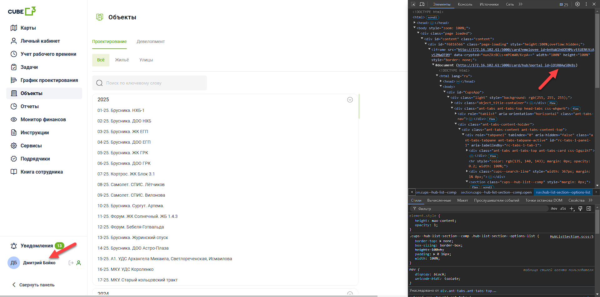
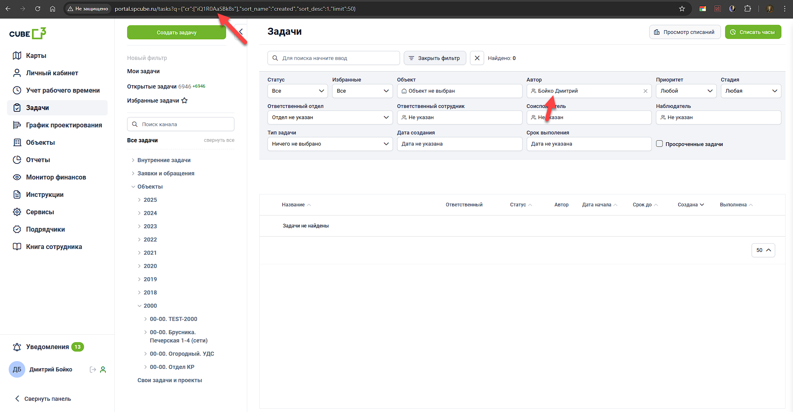
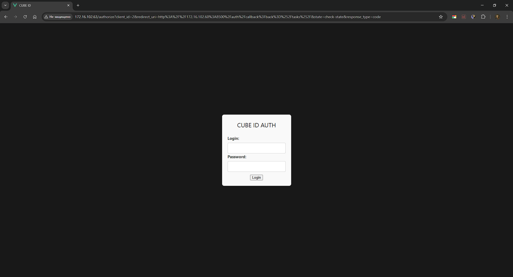

# Текущий вариант

1. Есть несколько сервисов и авторизация через форму осуществлена только на одном, считающим себя самым главным. В этой форме происходит авторизация по Active Directory. \
__Active Directory__ - авторизация пользователей, используемая во внутренней сети компании. Следовательно, когда мы будем выходить в сеть - неясно как мы будем авторизовывать пользователей, потому что Active Directory.

2. Логином пользователя является номер телефона, а паролем является 6-значный пароль от ПК. Пароль хранится в захэшированном виде с использованием устаревшей технологиии MD5. _Brute force_ хэша MD5 занимает максимум _8 часов_. [Статья](http://itsec.ru/articles2/tema/glavn_sobyt_2005_goda_8)

3. У наших сервисов как таковой авторизации нет. На всякий сервис с портала в небезопасном виде просто передается ID пользователя, который можно получить на портале в 2 клика. !
Следовательно, злоумышленник, получив, к примеру, ID пользователя с высоким уровнем доступа, может зайти в любой сервис и увидеть/изменить большое количество коммерческой информации. При выходе во внешнюю сеть это грозит большой утечкой данных.

Новые сервисы, которые вышли или вот-вот выйдут в продакшен, тоже вынуждены использовать этот метод авторизации, что делает сложившуюся ситуацию только хуже.

## Вывод
Текущий вариант реализации подходит для внутренней сети, но не для выхода во внешнюю сеть. Использование этого подхода влечет за собой колоссальные риски утечки данных и потери средств.

# Наш подход

_Современно, безопасно и просто._

Мы предлагаем использовать современную технологию авторизации - _OAuth2_, широко используемая в Google, Яндекс, Сбер и других корпорациях.

1. Сохраняется централизованность, но новая система будет соответствовать современным подходам реализации авторизации [RFC6749](https://datatracker.ietf.org/doc/html/rfc6749).

2. Вместо устаревшего алгоритма хэширования MD5, будет использоваться более современный и надежный bcrypt.

3. Все сервисы смогут аутентифицироваться на центральном сервисе, но этап авторизации реализуется на каждом сервисе по своим правилам. В новой реализации злоумышленник с большим усилием сможет узнать ID пользователя, но даже если ему это удастся, то у него всё равно не будет возможности получить доступ к данным.

Потенциально, новая реализация может быть интегрируема в любой сервис компании (в BIM, HR, Бухгалтерии или ИТО отделе).

4. Можно будет легко регистрировать новых пользователей: новых сотрудников, подрядчиков, заказчиков и других стейкхолдеров.

## Польза и выгода для компании

1. При разработке нового сервиса можно будет сосредоточиться на бизнес-логике, уделяя значительно меньше времени на реализацию авторизации.

2. Такой шаг перехода к микросервисной архитектуре будет основой для дальнейшей коммерциализации:
- Сегментировать рынок
- Гибко настраивать систему под конкретные нужды
- Простота масштабирования и ускорение разработки, экономя время разработки

3. Прототип сервиса уже реализован и проходит тестирование
